# master-thesis

## Summary Stats of the Dataset
|    |Speaker Party|Speaker Party                                        |Speaker Party|Speaker|Speaker                |Speaker|Phrase |Phrase |Phrase               |Phrase|Counts   |Counts            |Counts            |Counts|Counts|Counts|Counts|Counts|
|----|-------------|-----------------------------------------------------|-------------|-------|-----------------------|-------|-------|-------|---------------------|------|---------|------------------|------------------|------|------|------|------|------|
|    |unique       |top                                                  |freq         |unique |top                    |freq   |count  |unique |top                  |freq  |count    |mean              |std               |min   |25%   |50%   |75%   |max   |
|Term|             |                                                     |             |       |                       |       |       |       |                     |      |         |                  |                  |      |      |      |      |      |
|1   |13           |FDP.Die Liberalen (FDP-Liberale)                     |933620       |218    |Kaspar Villiger        |192278 |2985289|1894845|('million', 'frank') |198   |2985289.0|1.1386991343216686|1.2071007127226212|1.0   |1.0   |1.0   |1.0   |877.0 |
|2   |13           |FDP.Die Liberalen (FDP-Liberale)                     |801180       |227    |Hans-Rudolf Merz       |142279 |3202591|1993820|('million', 'frank') |202   |3202591.0|1.142585175565659 |1.154597995549102 |1.0   |1.0   |1.0   |1.0   |593.0 |
|3   |15           |Christlichdemokratische Volkspartei der Schweiz (CVP)|741225       |232    |Eveline Widmer-Schlumpf|128645 |3314197|2033677|('million', 'frank') |195   |3314197.0|1.147402523145124 |1.1349287025228894|1.0   |1.0   |1.0   |1.0   |322.0 |
|4   |12           |Sozialdemokratische Partei der Schweiz (SP)          |733029       |236    |Simonetta Sommaruga    |151986 |3427431|2096203|('artikel', 'absatz')|204   |3427431.0|1.160670192922921 |1.3422703360246826|1.0   |1.0   |1.0   |1.0   |568.0 |
|5   |15           |Sozialdemokratische Partei der Schweiz (SP)          |735257       |237    |Simonetta Sommaruga    |169380 |3149257|1941602|('million', 'frank') |204   |3149257.0|1.156980837067283 |1.244432181289119 |1.0   |1.0   |1.0   |1.0   |567.0 |

<!-- Previous Results: Prediction accuracy determined with 10-fold cross-validation:

[Results for Multinomial Logistic](Results/old/summary_result_terms_multinom_scaled.csv)

[Results for Regularized Logistic](Results/old/summary_result_terms_regLogistic_scaled.csv)

[Results for Random Forest](Results/old/summary_result_terms_randomForest_scaled_best.csv) -->

## Results for Restricted Analysis: SP & SVP
<!-- Multinom | regLogistic | randomForest
:--:|:--:|:--:
|| -->
Model | All Speakers | Consecutive Speakers
:--:|:--:|:--:
|Multinom   |  |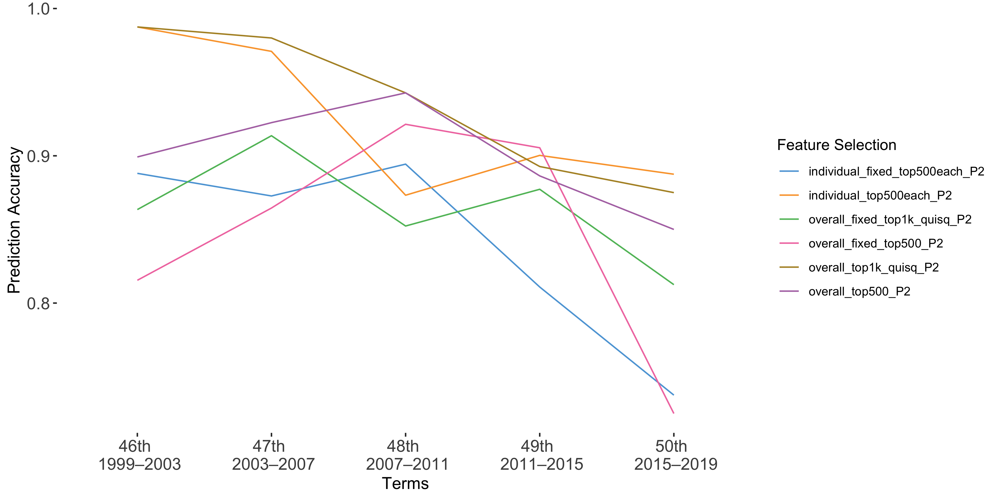 |
|regLogistic   |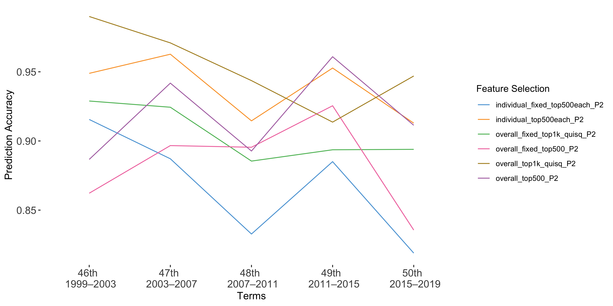|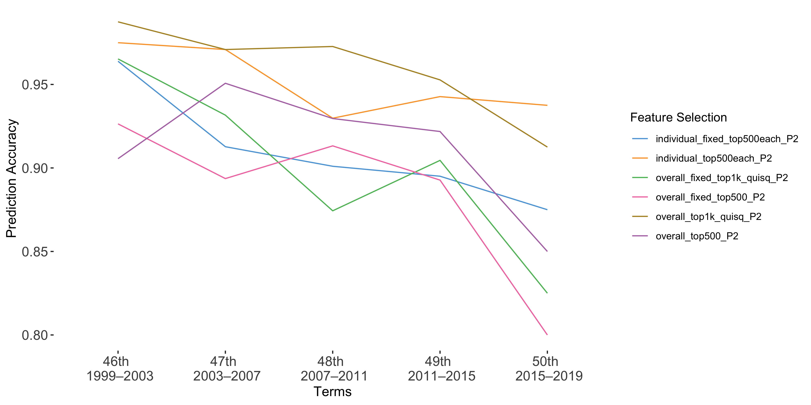
|randomForest|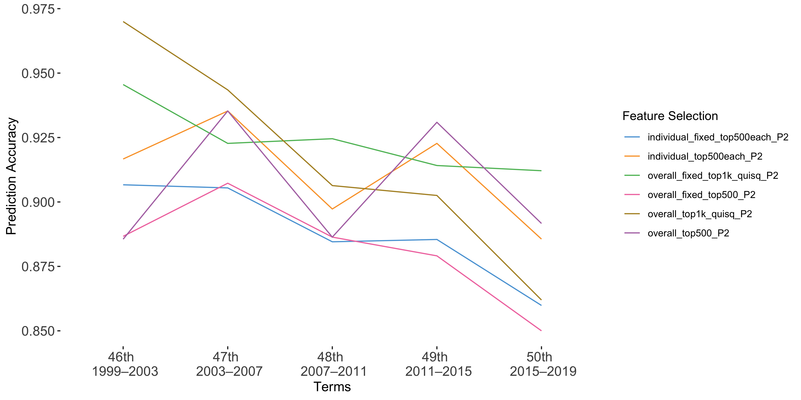|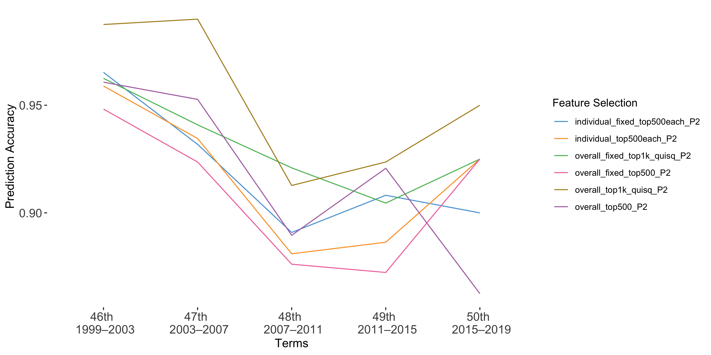

#### Some Summary Stats About the _individual_fixed_ Analysis
For each party, the 500 most significant phrases are selected from the entire speech catalog and kept fixed for the analysis over each term.
These stats examine the resulting distribution over the five terms from this method.

Distribution of Phrases  | Distribution of Speakers
:--:|:--:
  | 

## Results for Restricted Analysis: SP, CVP, FDP & SVP
<!-- Multinom | regLogistic | randomForest
:--:|:--:|:--:
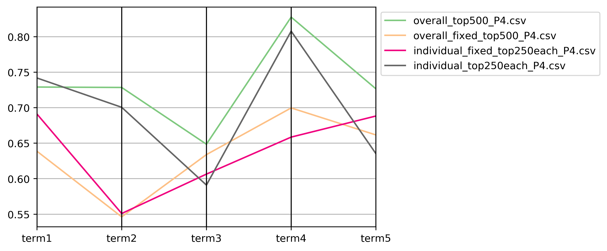|| -->

Model | All Speakers | Consecutive Speakers
:--:|:--:|:--:
|Multinom   | 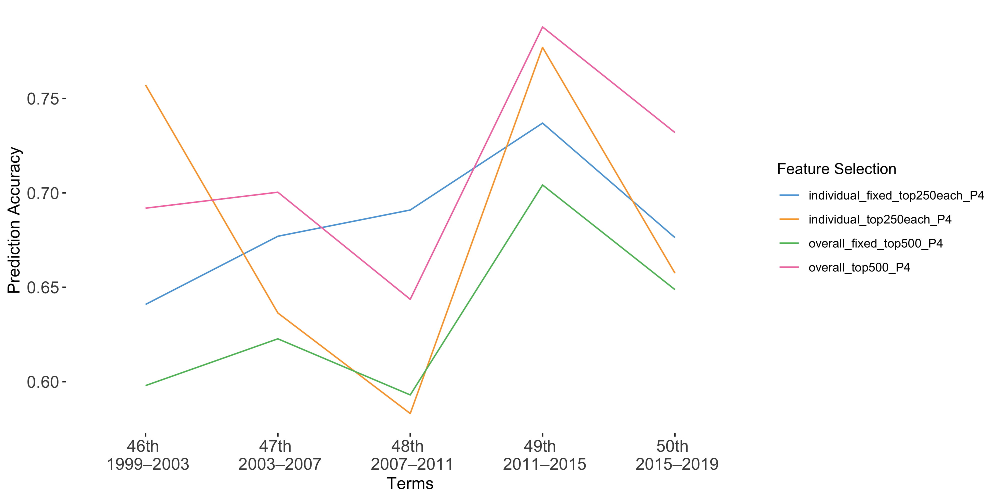| 
|regLogistic   | 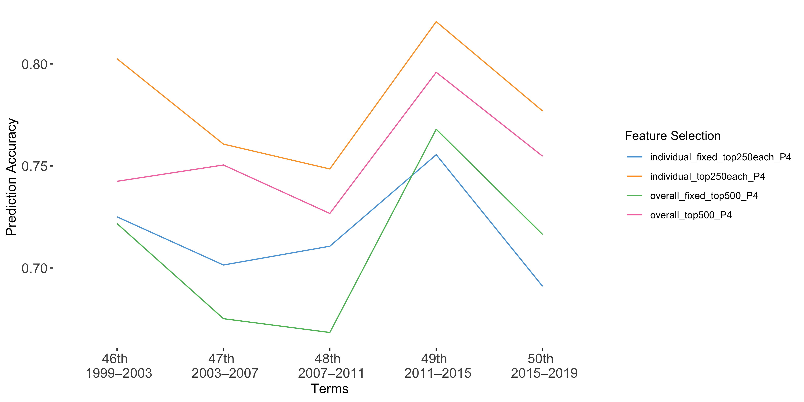 | 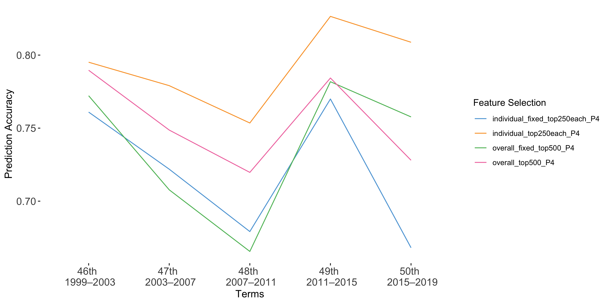
|randomForest| 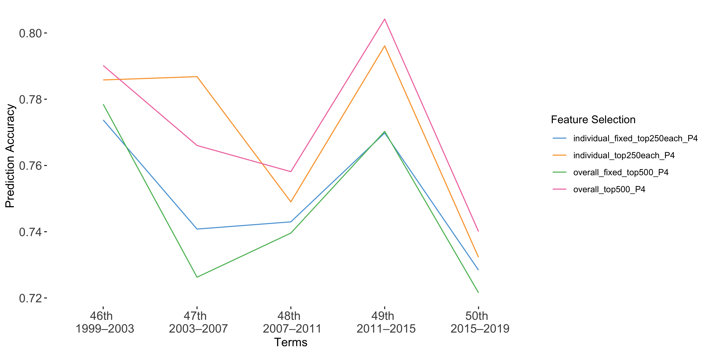| 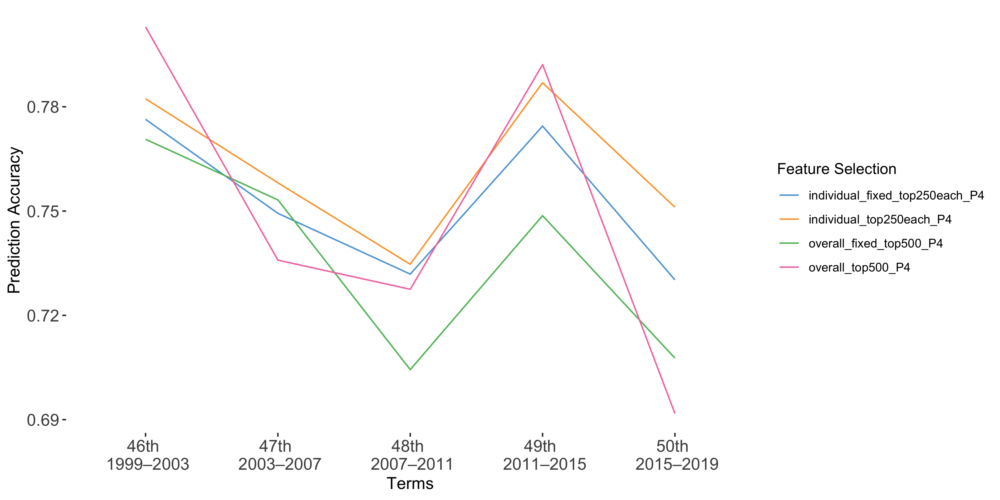
|elasticnet| |  |   |

#### Some Summary Stats About the _individual_fixed_ Analysis
For each party, the 250 most significant phrases are selected from the entire speech catalog and kept fixed for the analysis over each term.

Distribution of Phrases  | Distribution of Speakers
:--:|:--:
 | 

## Results for Analysis With All Parties
<!-- Multinom | regLogistic | randomForest
:--:|:--:|:--:
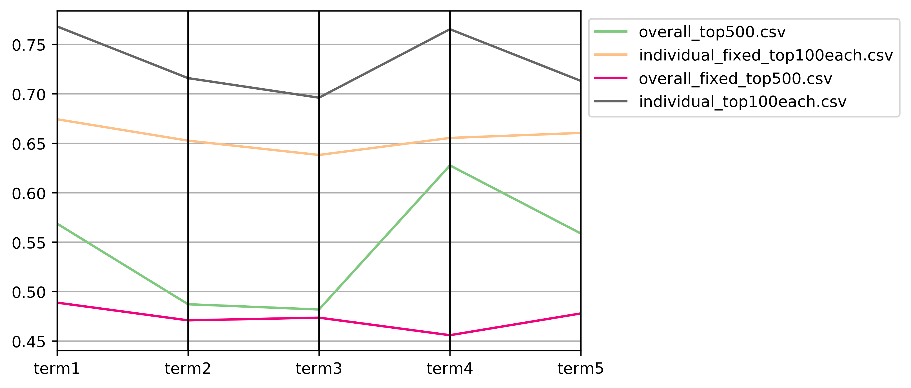|| -->
Model | All Speakers | Consecutive Speakers
:--:|:--:|:--:
|Multinom   | 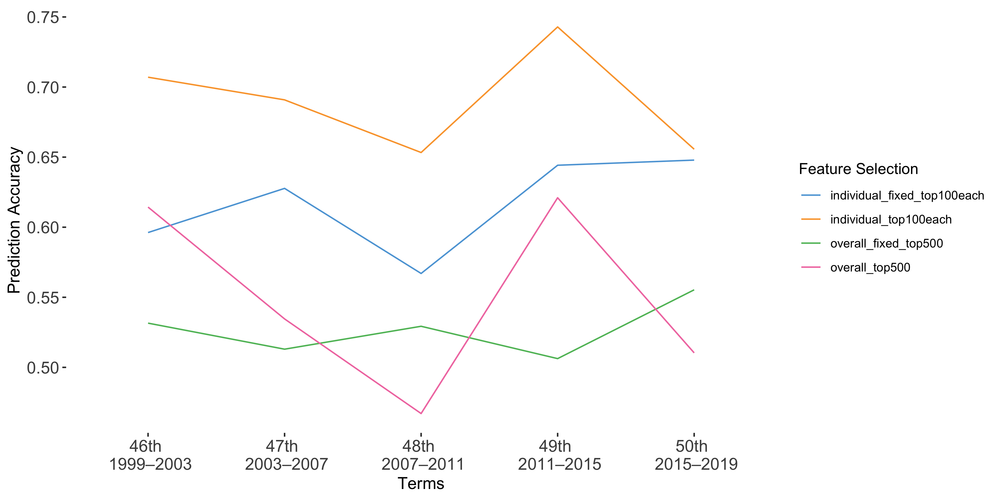 |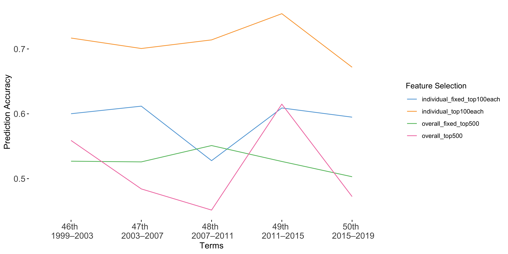
|regLogistic| 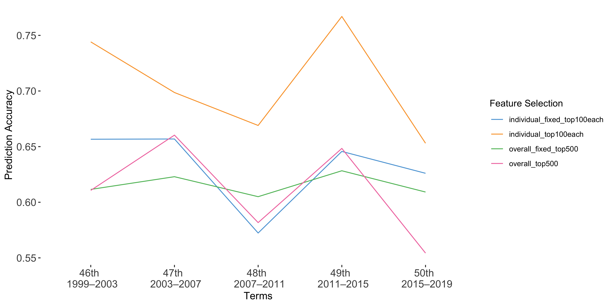 | 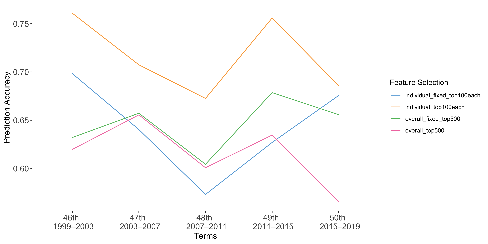
|randomForest|  |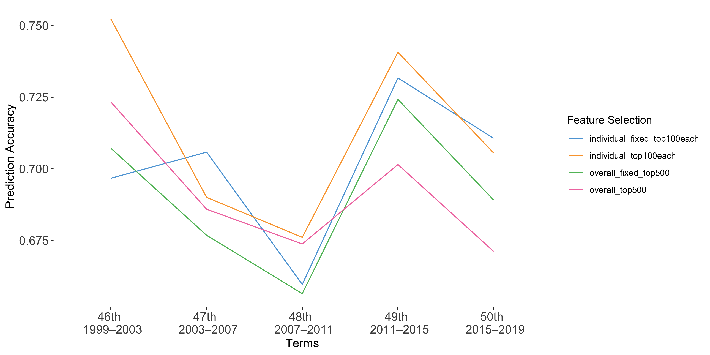
|elasticnet| 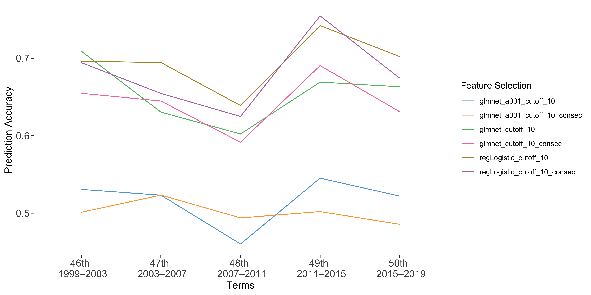|  |   |
#### Some Summary Stats About the _individual_fixed_ Analysis
For each party, the 100 most significant phrases are selected from the entire speech catalog and kept fixed for the analysis over each term.

Distribution of Phrases  | Distribution of Speakers
:--:|:--:
 | 

<!-- | data         | term1.rf.best      | term2.rf.best      | term3.rf.best      | term4.rf.best      | term5.rf.best      |
|--------------|--------------------|--------------------|--------------------|--------------------|--------------------|
| tfidf top500 | 0.7060330371383003 | 0.7024822134387352 | 0.6639619800489366 | 0.7229813664596273 | 0.6859479578392622 |
| tfidf top100 | 0.7154159608507434 | 0.662403538490495  | 0.6657872200263505 | 0.7280683229813665 | 0.7029644268774704 |
| cap 100      | 0.7071229457041814 | 0.6554663090532655 | 0.6446982872200263 | 0.6828379446640316 | 0.618729907773386  |
| cap 20       | 0.697914747342665  | 0.6758493318275927 | 0.6525179023874677 | 0.699111424807077  | 0.6835641025641026 | -->
