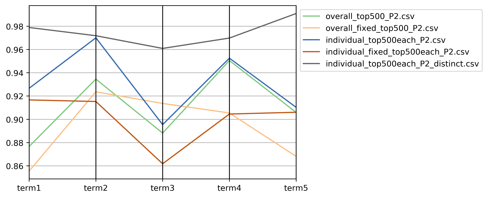

# master-thesis

Prediction accuracy determined with 10-fold cross-validation:

[Results for Multinomial Logistic](Results/summary_result_terms_multinom_scaled.csv)

[Results for Regularized Logistic](Results/summary_result_terms_regLogistic_scaled.csv)

[Results for Random Forest](Results/summary_result_terms_randomForest_scaled_best.csv)

## Results for Restricted Analysis: SP & SVP

### Some summary stats

Distribution of Phrases  | Distribution of Speakers
:--:|:--:
  | 

<!-- | data         | term1.rf.best      | term2.rf.best      | term3.rf.best      | term4.rf.best      | term5.rf.best      |
|--------------|--------------------|--------------------|--------------------|--------------------|--------------------|
| tfidf top500 | 0.7060330371383003 | 0.7024822134387352 | 0.6639619800489366 | 0.7229813664596273 | 0.6859479578392622 |
| tfidf top100 | 0.7154159608507434 | 0.662403538490495  | 0.6657872200263505 | 0.7280683229813665 | 0.7029644268774704 |
| cap 100      | 0.7071229457041814 | 0.6554663090532655 | 0.6446982872200263 | 0.6828379446640316 | 0.618729907773386  |
| cap 20       | 0.697914747342665  | 0.6758493318275927 | 0.6525179023874677 | 0.699111424807077  | 0.6835641025641026 | -->
